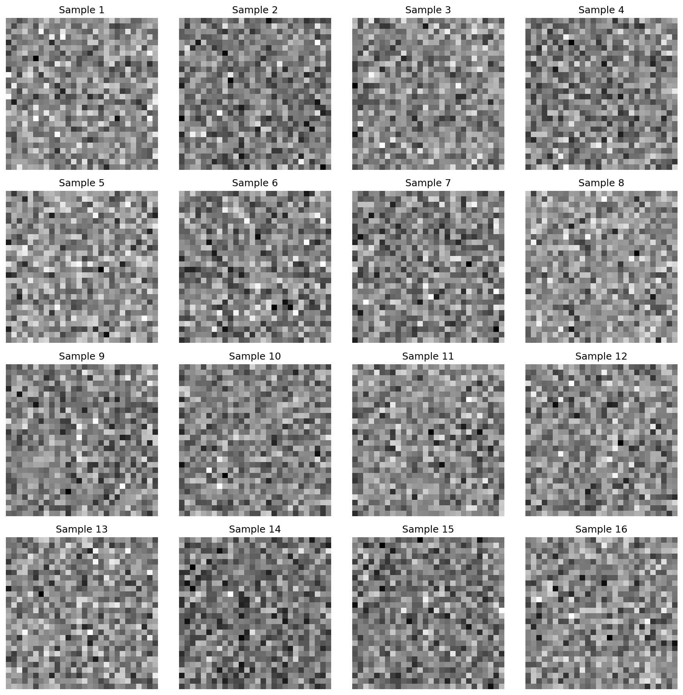

# Alphabet Letter GAN from Scratch using NumPy

A complete implementation of a Generative Adversarial Network (GAN) from scratch using only NumPy and basic mathematical operations, specifically designed to generate alphabet letters (A-Z). This project demonstrates the fundamental concepts of GANs, backpropagation, and deep learning without relying on any deep learning frameworks.

## Overview

This implementation includes:
- **Generator Network**: Transforms random noise into fake letter images
- **Discriminator Network**: Classifies images as real or fake letters
- **Training Loop**: Alternating optimization of both networks
- **Loss Functions**: Binary cross-entropy loss implementation
- **Activation Functions**: Sigmoid and ReLU with derivatives
- **Data Loading**: Alphabet letter dataset (A-Z) with synthetic letter generation

### Architecture and how it works

- **Generator (G)**: maps random noise `z ∈ R^64` → image `x̂ ∈ R^{28×28}` via two dense layers with ReLU then Sigmoid so outputs are in [0, 1]. It learns to produce letter-like strokes.
- **Discriminator (D)**: maps an image `x ∈ R^{28×28}` (flattened) → probability `p(real)` via two dense layers with ReLU then Sigmoid. It learns to detect real vs. generated letters.
- **Objectives**:
  - **D loss**: `L_D = BCE(D(x_real), 1) + BCE(D(G(z)), 0)` — maximize separation.
  - **G loss**: `L_G = BCE(D(G(z)), 1)` — fool D into predicting real.
- **Training loop (per step)**:
  1. Sample a batch of real letters and noise `z`.
  2. Forward through D on real and fake; compute `L_D`; backprop through D twice (real and fake) to update D.
  3. Resample `z`, forward G then D on `G(z)`; compute `L_G`; backprop through D to G; update G.
- **Data**: synthetic A–Z 28×28 glyphs built from ASCII templates with noise and slight random transforms for diversity.
- **Why it works**: G and D form an adversarial game; as D improves, G receives sharper gradients toward realistic strokes; as G improves, D must learn better letter features.

## Images and Preview

A few highlights from training.

- **Sample of generated letters** (post-training):

- **Progress during training** (generated snapshots):

| Epoch 0 | Epoch 1,000 | Epoch 3,000 | Epoch 5,000 | Epoch 7,000 |
|---|---|---|---|---|
|  |  |  |  |  |

- **Real vs Generated**

- **Demo grid**

- **Alphabet dataset samples** (synthetic letters used for training):

